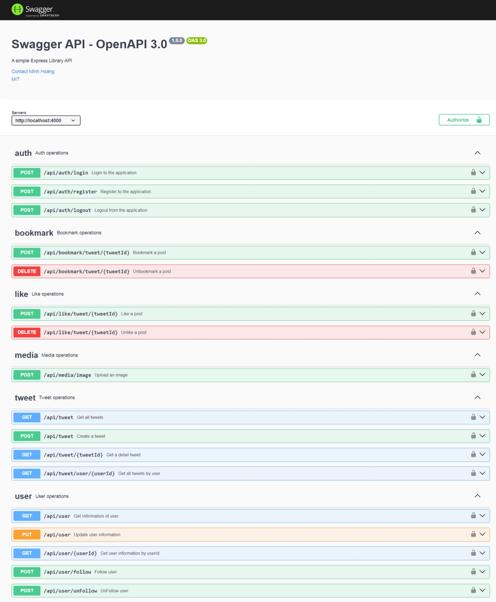

# TWITTER API
Twitter API is comprehensive and user-friendly RESTful API designed to provide developers with easy access to related information of social network. If you are building a social network, Twitter API offers robust and reliable endpoints to fetch data on user's infor, posts and more.
## Techonologies and frameworks
* TypeScript
* Nodejs
* ExpressJs
* MongoDB
## INSTALL
* Clone project
```bash
git clone https://github.com/minghoan/Twitter-API
```
This is the result if you install successfully
